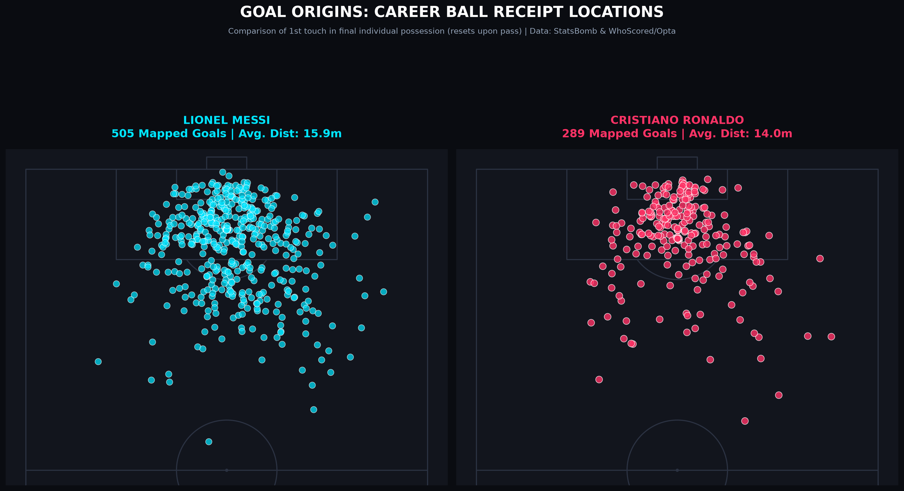
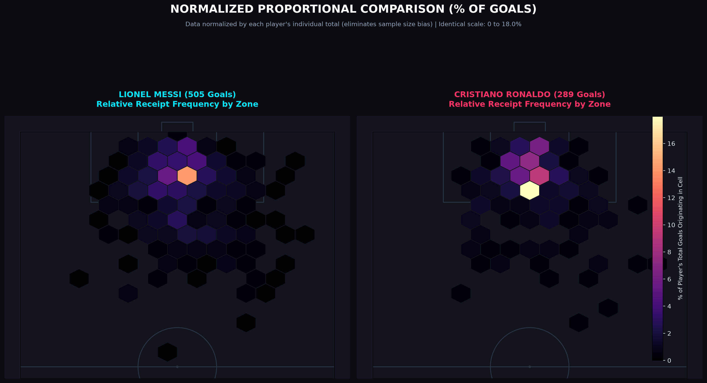
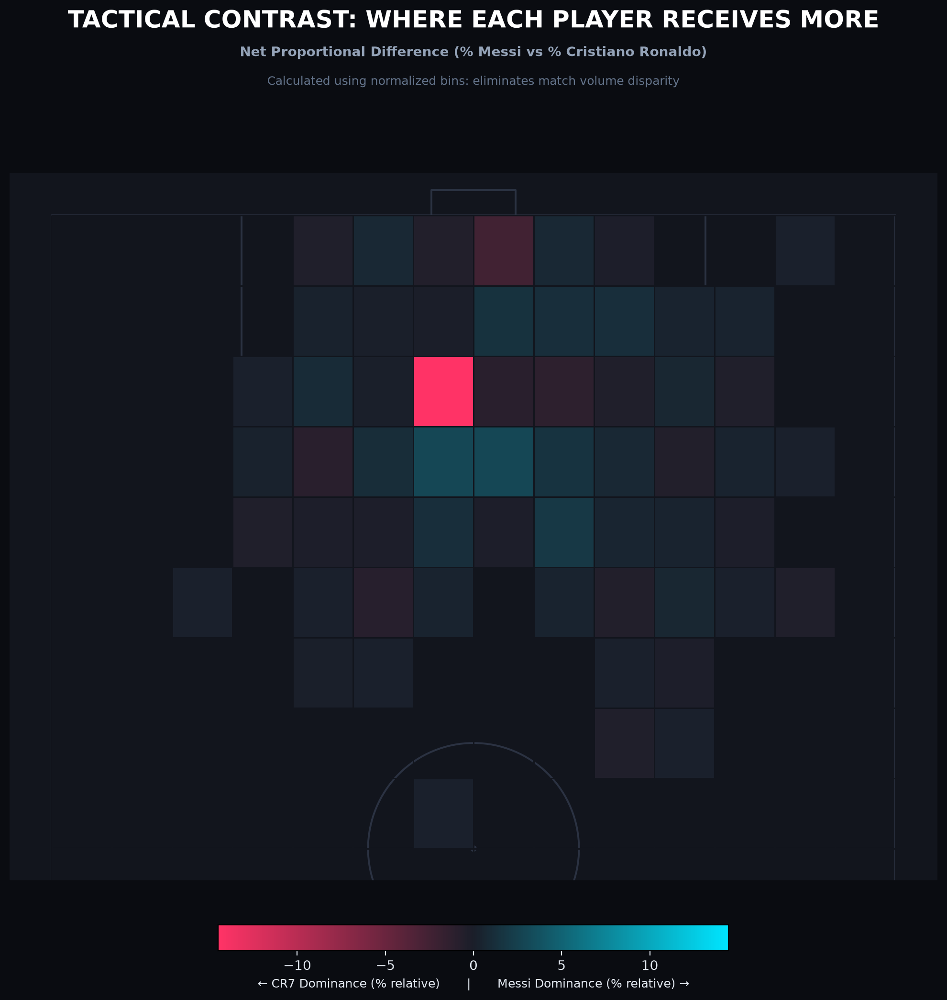
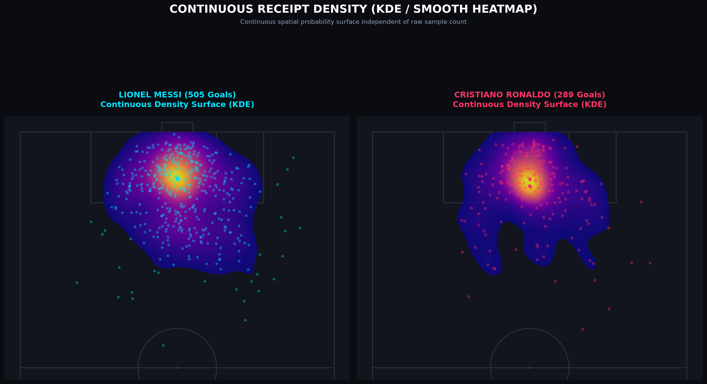
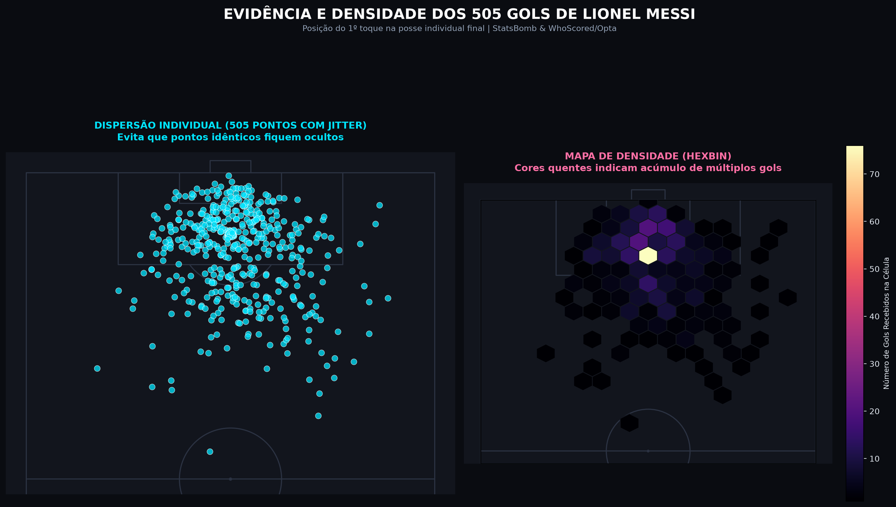
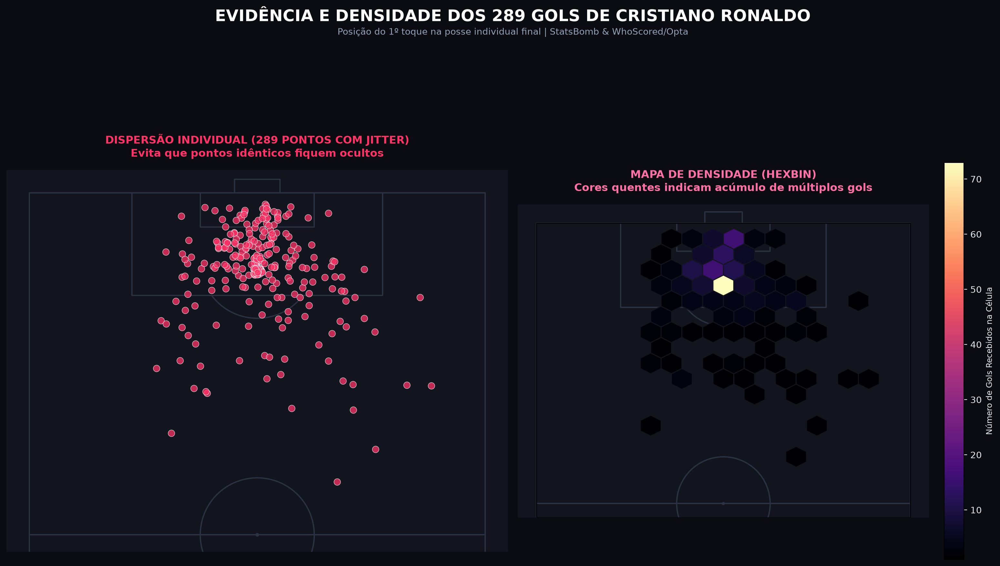

# Origem dos Gols: Rastreamento Tático de Recepção da Bola (Messi vs Cristiano Ronaldo)

Este projeto realiza uma análise espacial e tática inédita sobre a **origem dos gols** de **Lionel Messi** e **Cristiano Ronaldo**. Em vez de focar apenas no local de onde o chute foi desferido (*shot maps* convencionais), este estudo rastreia exatamente **onde o jogador recebeu a bola** no lance que culminou no gol.

---

## 🎯 Regra da Posse Individual (Reset de Posse)

A metodologia foi desenhada para isolar a ação direta do artilheiro:

1. O rastreamento parte do chute a gol e retrocede cronologicamente na cadeia de eventos daquela posse de bola.
2. **Reset de Posse:** Se o jogador passar a bola para um companheiro e recebê-la de volta mais à frente, a posse anterior é descartada e resetada. O ponto mapeado é exclusivamente o da **recepção final da bola que antecedeu o gol**.
3. Se o lance decorre de um passe de um companheiro (assistência), o ponto registrado é a coordenada exata de recepção (`endX, endY` do passe).
4. Se o jogador conduziu ou driblou antes de finalizar, o ponto registrado é o seu primeiro toque dessa ação individual contínua.
5. Em cobranças de falta direta, pênaltis ou rebotes de primeira, a coordenada de recepção coincide com o local do chute.

---

## 📊 Cobertura dos Dados (Multi-Liga & Multi-Época)

Para maximizar a amostra histórica de ambos sem depender de planos pagos comerciais, combinamos dados abertos da **StatsBomb** e eventos granulares da **Opta (via WhoScored)**:

* **Lionel Messi (505 Gols Mapeados):**
  * Toda a trajetória pelo FC Barcelona em La Liga (2004/05 a 2020/21) na base aberta da StatsBomb.
  * Copas do Mundo FIFA (2014, 2018 e 2022).
  * Distância média da recepção: **15.9 metros** do gol.

* **Cristiano Ronaldo (289 Gols Mapeados):**
  * **StatsBomb Open Data (56 gols):** Copa do Mundo FIFA 2018, UEFA Euro 2020 e Champions League.
  * **WhoScored / Opta Feeds (233 gols):**
    * **Real Madrid (La Liga):** Temporadas 2014/15 (48 gols), 2015/16 (35 gols), 2016/17 (25 gols) e 2017/18 (26 gols).
    * **Juventus (Serie A):** Temporadas 2018/19 (21 gols), 2019/20 (31 gols) e 2020/21 (29 gols).
    * **Manchester United (Premier League):** Temporada 2021/22 (18 gols).
  * Distância média da recepção: **14.0 metros** do gol.

---

## 🖼️ Visualizações Táticas

### 1. Comparação Lado a Lado (Dispersão Limpa)
Dispersão dos pontos individuais de recepção na metade ofensiva do campo (Pitch StatsBomb / mplsoccer em tema escuro):



---

### 2. Comparação Proporcional Normalizada (% dos Gols)
Para eliminar a disparidade entre o tamanho das amostras (505 gols vs 289 gols), cada célula hexagonal calcula a **porcentagem do total de gols daquele próprio jogador** (`% do Total`), compartilhando a mesma escala de cores unificada (0% a 18%):



---

### 3. Mapa de Contraste Tático Direto (Diferença Líquida: Messi vs CR7)
Subtração direta entre as distribuições percentuais (`% Messi - % Cristiano Ronaldo`), evidenciando a especialidade de cada um:
* **Ciano:** Zonas onde Messi recebe proporcionalmente muito mais que Cristiano.
* **Rosa/Vermelho:** Zonas onde Cristiano recebe proporcionalmente muito mais que Messi.



---

### 4. Superfície de Densidade Contínua (KDE / Heatmap Suave)
Função de densidade de probabilidade espacial (*Kernel Density Estimation*), mapeando os epicentros gravitacionais de cada jogador:



---

### 5. Evidências de Concentração Individual (Dispersão com Jitter + Hexbin)

#### Lionel Messi (505 Gols)


#### Cristiano Ronaldo (289 Gols)


---

## 🧠 Principais Conclusões Táticas

1. **Lionel Messi (Construtor-Finalizador):**
   * Ponto focal na **Zona 14** (entrada da área) e nos *half-spaces*.
   * Grande volume de recepções na intermediária e corredor central para conduzir e acelerar.
   * Ampla dispersão espacial no último terço.

2. **Cristiano Ronaldo (Operador de Área & Finalizador Letal):**
   * Epicentro de calor concentrado diretamente **no miolo da grande área e pequena área**.
   * Forte volume de finalizações de 1º toque oriundas de cruzamentos e passes em profundidade.
   * Movimentação vertical focada em antecipação e posicionamento dentro do bloco adversário.

---

## 🚀 Como Executar o Projeto

### 1. Clonar o repositório e instalar dependências
```bash
git clone https://github.com/Jvamg/goal-origins-messi-vs-cr7.git
cd goal-origins-messi-vs-cr7

python3 -m venv .venv
source .venv/bin/activate
pip install -r requirements.txt
```

### 2. Gerar as Visualizações
O script lê os dados pré-processados na pasta `data/` e renderiza os gráficos em segundos:

```bash
# Gerar todos os gráficos de uma vez (dispersão, densidade, normalizados e contraste):
python3 visualizar_origem_gols_carreira.py --todos

# Gerar apenas os mapas de dispersão e densidade hexbin:
python3 visualizar_origem_gols_carreira.py --densidade

# Gerar as análises estatísticas normalizadas (% relativa, contraste tático e KDE):
python3 visualizar_origem_gols_carreira.py --normalizado

# Gerar gráfico de um jogador individual:
python3 visualizar_origem_gols_carreira.py --jogador messi
python3 visualizar_origem_gols_carreira.py --jogador cristiano
```

### 3. Coleta de Novas Ligas / Atualização de Dados
Se desejar reexecutar os coletores e extrair temporadas adicionais:
* `src/scraper_whoscored.py`: Coleta fixtures e eventos da Opta via WhoScored para ligas europeias.
* `src/scraper_statsbomb.py`: Extrai e processa partidas públicas da StatsBomb.

---

## 🛠️ Tecnologias Utilizadas
* **Python 3.12**
* **[mplsoccer](https://mplsoccer.readthedocs.io/):** Desenho de gramados táticos e mapas de eventos.
* **[StatsBombPy](https://github.com/statsbomb/statsbombpy):** Acesso à API de dados abertos da StatsBomb.
* **[SoccerData](https://soccerdata.readthedocs.io/):** Web scraping de eventos da Opta/WhoScored.
* **Matplotlib, Pandas, NumPy & SciPy:** Computação espacial, KDE e binning 2D.
